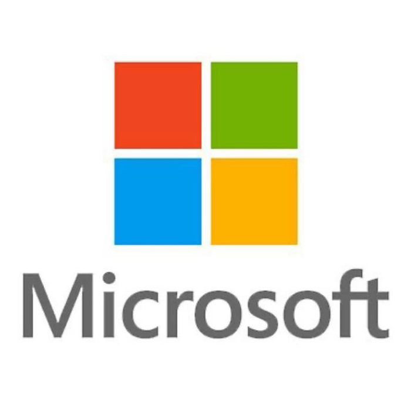
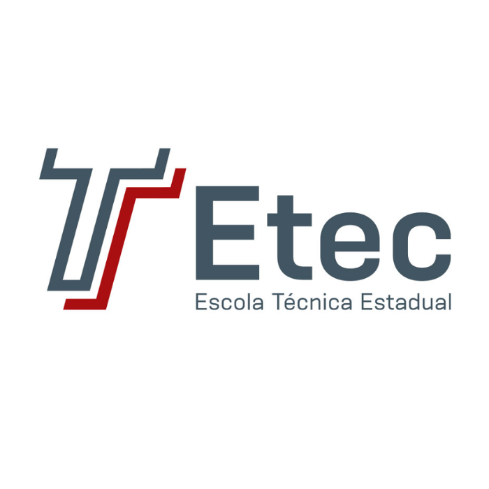

<h1>Lucas Felix</h1>

 
  texto

  texto

 

<h2>📜 Certificações</h2>

<table>
  
  <tr>
    <td style="width: 240px; height: 240px; padding: 0; vertical-align: middle; text-align: center;">
      
    </td>
    <td>
      <a href=""> <b>Free Code Camp - Scientific Computing with Python</b> </a>  
      <b>Descrição:</b> Curso focado em computação científica utilizando a linguagem Python. Aborda desde fundamentos como estruturas de dados e algoritmos até conceitos mais avançados como Programação Orientada a Objetos e manipulação de dados para cálculos complexos.  
    </td>

  </tr>

  <tr>
    <td style="width: 240px; height: 240px; padding: 0; vertical-align: middle; text-align: center;">
      
    </td>
    <td>
      <a href=""> <b> Microsoft - Foundational C# with Microsoft Certification</b> </a>  
      <b>Descrição:</b> Formação desenvolvida em parceria com a Microsoft, com foco na aplicação prática da linguagem C# no desenvolvimento de software. O conteúdo abrange desde a criação de aplicações de console até a implementação de lógica condicional, manipulação de dados, organização de código com métodos e técnicas de depuração.  
    </td>

  </tr>

</table>

<h2>🎓 Formação</h2>

<table>
  <tr>
    <td style="width: 240px; height: 240px; padding: 0; vertical-align: middle; text-align: center;">
      
    </td>
    <td>
      <b>ETEC - Centro Paula Souza</b>  
      <b>Curso Técnico em Desenvolvimento de Sistemas</b>  
      <b>Conclusão:</b> [Ano de Conclusão]  
      Formação técnica com foco em programação, banco de dados, lógica computacional e desenvolvimento de sistemas web e desktop com forte ênfase em prática e projetos aplicados.
    </td>
  </tr>

  <tr>
    <td style="width: 240px; height: 240px; padding: 0; vertical-align: middle; text-align: center;">
      
    </td>
    <td>
      <b>UNIVESP - Universidade Virtual do Estado de São Paulo</b>  
      <b>Engenharia da Computação</b>  
      <b>Status:</b> Cursando  
      Graduação com foco em fundamentos da engenharia, estrutura de dados, algoritmos, arquitetura de computadores, sistemas operacionais e desenvolvimento de software.
    </td>
  </tr>
</table>

 

<h2>Contatos </h2>

{text}

  

  <a href="https://www.linkedin.com/" alt="Linkedin">

  

